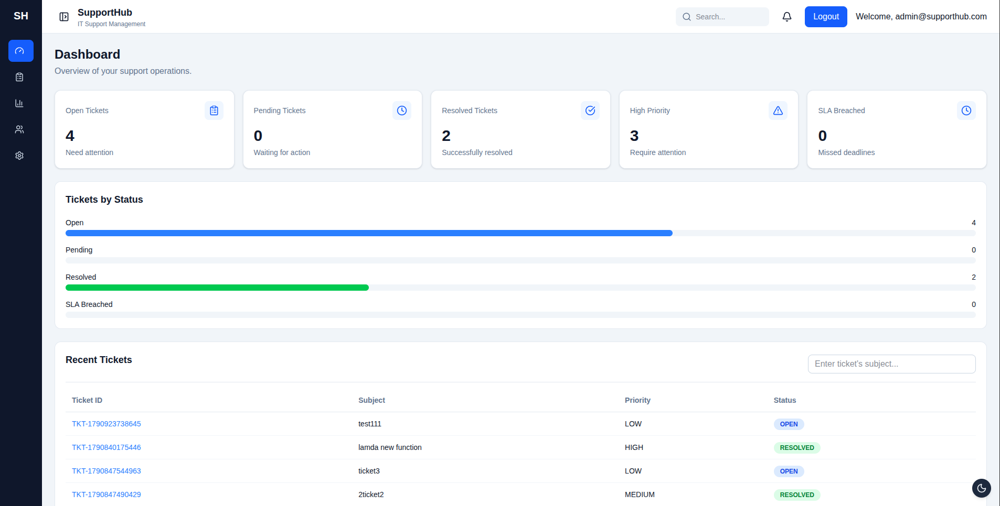
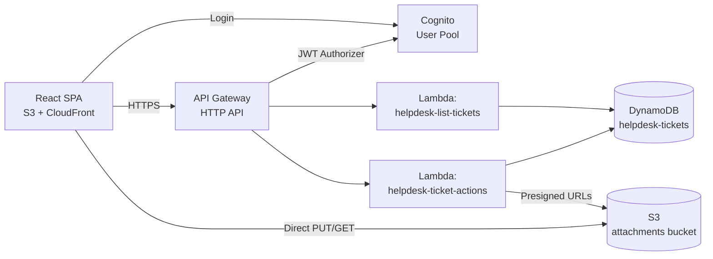

# IT Helpdesk Ticketing System

A full-stack ticketing system built to learn and demonstrate production React patterns:
Redux Toolkit, Zustand, Context API, TanStack Query & Table, AWS Cognito auth with RBAC,
and a serverless backend on API Gateway, Lambda, DynamoDB and S3.

**Live demo:** https://vercel.com/dineshtm/helpdesk-system



## Features

- JWT authentication via AWS Cognito, with role-based access control (Admin / Support Agent / User)
- Ticket CRUD: create, edit, change status, assign an agent, delete
- Bulk selection and bulk status update
- Server-side-backed search, filter, sort and pagination (TanStack Table)
- Comment timeline per ticket, with optimistic UI
- File attachments uploaded directly to S3 via presigned URLs
- Dashboard with live KPI cards and a recent-tickets table
- Fully serverless backend (API Gateway + Lambda + DynamoDB + S3)

## Architecture



**Why these tools, not alternatives:**

| Layer | Tool | Why |
|---|---|---|
| Ticket data (shared, cross-cutting, many mutation types) | Redux Toolkit | Multiple components read the same list; updates have real logic (bulk status, assignment) worth tracing through actions |
| Server cache (tickets, comments) | TanStack Query | Handles loading/error states, caching, refetching and optimistic updates without hand-rolled `useEffect` chains |
| UI-only state (filters, sidebar, modals) | Zustand | Local/global state with minimal boilerplate, no business logic |
| Auth/theme (rarely changes, read everywhere) | Context API | Simple provider, no complex update logic needed |
| Table (sort/filter/paginate/select) | TanStack Table | Headless — logic only, so our own Tailwind markup stays in full control |

## Tech stack

React 18 · Redux Toolkit · Zustand · TanStack Query v5 · TanStack Table v8 · React Hook Form + Yup ·
Tailwind CSS · AWS Cognito · API Gateway (HTTP API) · AWS Lambda (Node 20) · DynamoDB · S3 + CloudFront

## Local setup

```bash
git clone <your-repo-url>
cd helpdesk-system
npm install
cp .env.example .env   # then fill in your own values, see below
npm run dev
```

## Environment variables

| Variable | Description |
|---|---|
| `VITE_COGNITO_USER_POOL_ID` | Cognito User Pool ID |
| `VITE_COGNITO_CLIENT_ID` | Cognito App Client ID (public client, no secret) |
| `VITE_AWS_REGION` | AWS region, e.g. `eu-north-1` |
| `VITE_API_BASE_URL` | API Gateway invoke URL |

Never commit `.env` — it's git-ignored. See `.env.example` for the required keys with empty values.

## API endpoints

| Method | Path | Description |
|---|---|---|
| GET | `/tickets` | List all tickets |
| GET | `/tickets/{id}` | Get one ticket |
| POST | `/tickets` | Create a ticket |
| PUT | `/tickets/{id}` | Update a ticket |
| DELETE | `/tickets/{id}` | Delete a ticket |
| PATCH | `/tickets/{id}/status` | Change status |
| PUT | `/tickets/{id}/assign` | Assign an agent |
| POST | `/tickets/bulk-status` | Bulk status update |
| POST | `/tickets/{id}/comments` | Add a comment |
| POST | `/uploads/presign` | Get a presigned S3 upload URL |
| GET | `/uploads/presign-download` | Get a presigned S3 download URL |

All routes (except none — every route) require a valid Cognito JWT, verified by API Gateway's built-in authorizer before the request ever reaches Lambda.

## Demo accounts

| Role | Email | Password |
|---|---|---|
| Admin | admin@supporthub.com | Admin@123 |
| Support Agent | agent@supporthub.com | Agent@123 |
| User | user@supporthub.com | User@123 |

## Screenshots

| Dashboard | Ticket list | Ticket details |
|---|---|---|
|  |  |  |

## Testing

```bash
npm run test
```

6 suites covering: login flow, form validation, table rendering/filtering, the ticket-selection reducer, the Zustand filter store, and the `useDebounce` hook.